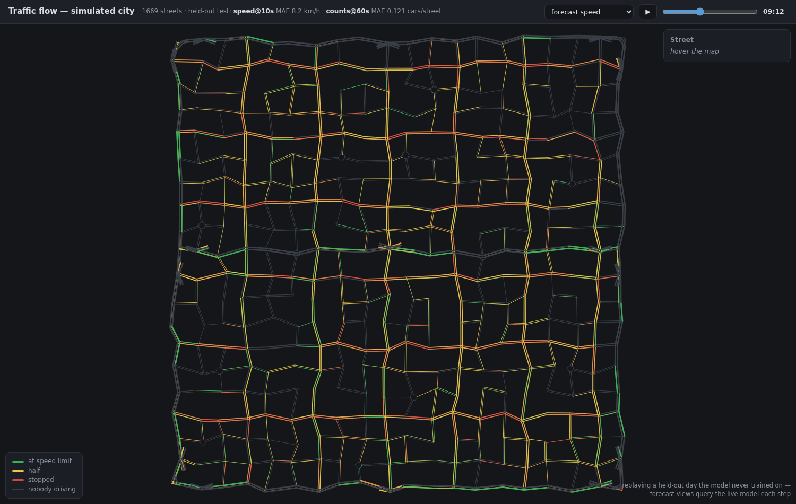

# Traffic Simulator — a simulated city with a shipped ML pipeline

A 2D city traffic simulator written from scratch in Python, used as the data
factory for a complete machine-learning pipeline: the simulator generates
traffic data, a forecasting model is trained and honestly evaluated on it, and
the fitted model is served as a web API packaged in a Docker image you can run
with one command.

**Simulator → dataset → trained model → FastAPI service → Docker.** Every link
in that chain lives in this repository and is tested.



*The served frontend at 09:12 on a day the model never trained on: every
street coloured by the model's speed forecast (red stopped → green at the
limit), greyed where its occupancy forecast expects nobody. Other views show
observed speed/occupancy, street class, and [land use](docs/screenshots/land-use.png).*

## Try it (no checkout needed)

```bash
docker run --rm -p 8000:8000 contefran/traffic-flow
```

Then:

- `curl localhost:8000/health` — the model's scorecard: which forecast cells
  are loaded and their measured error on held-out days.
- `http://localhost:8000/docs` — interactive API documentation.
  `POST /predict` takes today's per-street observations so far (mean speed and
  car count per 10 s bin, `null` speed where nothing drove) and returns the
  per-street forecast.

The image ([contefran/traffic-flow](https://hub.docker.com/r/contefran/traffic-flow))
is self-contained: the fitted model bundle, its feature pipeline, and the
exact library versions it was trained with are baked in.

## The simulator

An explicit, step-based simulation — readable code and easy extensibility
over physical realism; every behaviour is understandable by reading a few
functions. The core is dependency-free (no numpy/matplotlib), which is what
lets it run headless inside services and tests.

- **Road network**: a heterogeneous city grid — jittered geometry, one-way
  streets, missing links (always repaired to stay fully connected), fast
  arterials, geometric roundabouts, and a grade-separated elevated ring +
  expressway with proper tapered on/off-ramps.
- **Driving**: the Intelligent Driver Model (car-following), MOBIL-style lane
  changes and overtaking, kinematic slowdown into turns, and a mixed vehicle
  fleet (city cars, sports cars, trucks, buses) with per-driver personality
  jitter.
- **Intersections**: pluggable signal controllers (fixed-time permissive and
  protected-left phasing) with per-node cycle/split/offset timing,
  speed-scaled yellow times, and a classical green-wave coordination
  baseline; right-of-way with gap acceptance at unsignalized junctions and
  roundabout entries.
- **Demand**: land-use zones (residential/office/retail districts), and an
  activity-based population — every car has a home, a workplace (near home
  for most; a share of cross-town long commuters feeds the highway), and a
  personal daily plan (commute, lunch, gym, pub), executed around the clock
  with parking and dwelling. Rush hours *emerge* from the schedules.
- **Safety as a metric**: collisions are physically meaningful (a car that
  could not stop even at its physical braking limit) and are counted, never
  hidden — a default simulated day is ~2 genuine crashes among 1000 cars,
  and each residual crash mechanism is understood and documented.
- **Instrumentation**: per-trip delay vs free-flow baseline, per-street and
  per-intersection time series, fuel proxy, fundamental diagram — plus a live
  animated map with a wall clock and an interactive dashboard with sliders
  that mutate the running city (speed limits, following gaps, signal timing).

## The ML pipeline

The simulated city is non-stationary (rush hours, day-to-day demand
variability), so it poses a real forecasting problem: *given today's traffic
so far, predict each street's near-future state*. The pipeline, in the order
it was built — with the measured verdict at each step:

1. **Dataset** (`ml/dataset.py`) — seeded full-city days recorded at 0.1 s
   and aggregated to 10 s bins per street; empty streets are `NaN`, not zero
   (nobody driving is not the same as standing traffic). Train/val/test are
   split by whole days, never shuffled rows.
2. **Baselines** (`ml/baselines.py`) — persistence ("speed now = speed in
   60 s") and climatology (the per-street average day). Climatology set the
   bar to beat; persistence loses badly because single 10 s bins are
   dominated by signal-phase noise.
3. **Models** — ridge regression and gradient-boosted decision trees, both
   written from scratch in numpy, then cross-checked against scikit-learn
   implementations behind the same interface (agreement within a few percent
   in every cell — the from-scratch versions validated, the library promoted
   for serving). Features include lagged street state, climatology, a
   city-wide "busyness" ratio, and the state of each street's feeder and
   receiver streets.
4. **Error analysis** (`ml/analysis.py`) — permutation importance and error
   slices by hour/street class. Findings fed back into features; hypotheses
   that failed are recorded as retired, not quietly dropped.

**What's served** — each channel at the horizon where it has measured skill,
scored on held-out days the model never saw:

| Forecast cell | Climatology baseline | Served model |
|---|---|---|
| Street speed, 10 s ahead | 11.7 km/h MAE | **8.2 km/h MAE** |
| Street occupancy, 60 s ahead | 0.140 cars MAE | **0.121 cars MAE** |

An honest, measured limitation worth stating: beyond ~1 minute, speed
forecasting in this city hits a ceiling — the demand pattern repeats daily,
so the average day is nearly optimal and extra model capacity cannot help.
The pipeline proves *why* (state information decays within ~2–3 signal
cycles) rather than hiding it.

## Serving

`ml/artifact.py` fits the promoted models once and writes a single bundle
file carrying the models, every learned table, the static street facts, and
its own test scorecard. `ml/serve.py` (FastAPI) loads it at startup. The
service never rebuilds a feature: requests are handed to the *training*
feature pipeline, so the served forecast is bit-identical to the offline
evaluation — the classic training–serving-skew bug is closed by
construction, and an end-to-end test pins it. The `Dockerfile` packages the
service with serving-only dependencies pinned to the versions the bundle was
fitted with.

## Scope and limitations

The trained model is deliberately **city-specific**. The dataset contract
fixes the road network across all runs, so the model learns these 1669
streets as individuals — its strongest feature is each street's own average
day — and the served bundle is meaningless on any other map (the serving
layer actually enforces this: geometry can only be attached to a bundle
after the rebuilt city is validated against the stored network). What *does*
carry over to any city running the same traffic dynamics: the entire
pipeline (dataset → baselines → models → artifact → API → container reruns
unchanged on a new map), and the qualitative findings — the ~1-minute decay
of state information, climatology's dominance at medium horizons under
periodic demand, demand revealing itself through occupancy rather than
speed, queues preceding slowdowns. The numbers are this city's; the shape of
the results is the traffic model's.

The transferable version — a model trained on street *descriptions* (speed
limit, length, lanes, land use, neighbour state) across many generated
cities, rather than street *identities* in one — is the natural future-work
direction (graph neural networks fit the road-graph structure directly), and
the same distinction will apply to the reinforcement-learning phase: a
timing plan for this city's intersections versus a policy any intersection
could run.

## Running from source

```bash
python -m venv .venv && source .venv/bin/activate
pip install -r requirements.txt

python main.py                 # animated day in the default city (1000 cars)
python main.py --dashboard     # interactive knobs + live metrics panel
python main.py --help          # every flag: grid size, cars, signals, ...

MPLBACKEND=Agg python -m pytest -q    # test suite, headless
```

Rebuilding the ML artefacts from scratch:

```bash
python -m ml.dataset --out ml/data/varied --intensity-range 0.55 1.0   # minutes–hours (parallel over all cores)
python -m ml.artifact --data ml/data/varied                            # fit + save bundle
python -m ml.serve                                                     # serve it
docker build -t traffic-flow .                                         # box it
```

## Project structure

```
traffic_sim/          # the simulator package (dependency-free core)
  network.py            # road network + city builders + all geometry
  simulation.py         # the step loop: car-following, lanes, transfers
  vehicles.py           # cars, vehicle types, driver personality
  routing.py            # random + fastest-path destination routing
  signals.py            # signal controllers, per-node timing, green wave
  priority.py           # right-of-way at unsignalized junctions
  zones.py / demand.py / activities.py / parking.py   # land use → daily life
  grade.py / roundabouts.py                           # elevated ring, roundabouts
  metrics.py            # trips, delay, safety, per-street time series
  visualization.py / dashboard.py                     # animation, live controls
  tuning.py             # flat parameter vector ↔ signal timing (the RL surface)
ml/                   # the ML pipeline consuming the simulator
  dataset.py  baselines.py  linear.py  gbdt.py  sklearn_models.py
  analysis.py  artifact.py  serve.py
experiments/          # reproducible studies (signal phasing, gap sweeps, ...)
tests/                # pytest suite covering both packages
main.py               # CLI entry point
Dockerfile            # the serving image
```

## Roadmap

1. ✅ Cars on edges → intersections → signals → routing → metrics
2. ✅ A living city: zones, activity-based demand, parking, day/night
3. ✅ Near-crash-free base model (every residual collision understood)
4. ✅ Flow forecasting pipeline: dataset → baselines → models → analysis
5. ✅ Serving: model artifact → FastAPI → Docker (→ Docker Hub)
6. ✅ Map frontend: the live city replayed and coloured by the service's
   forecasts, shipped inside the image
7. ⏳ Reinforcement learning: optimize per-intersection signal timing
   against the measured green-wave baseline

## Design philosophy

Explicit state, readable updates, no black boxes; behaviours (traffic jams,
the flow–density relation, rush hours) *emerge* from simple local rules
rather than being imposed. Measured claims over plausible ones — every model
comparison in this README comes from seeded, reproducible runs on held-out
data, and negative results are kept on the record.

## License

MIT
